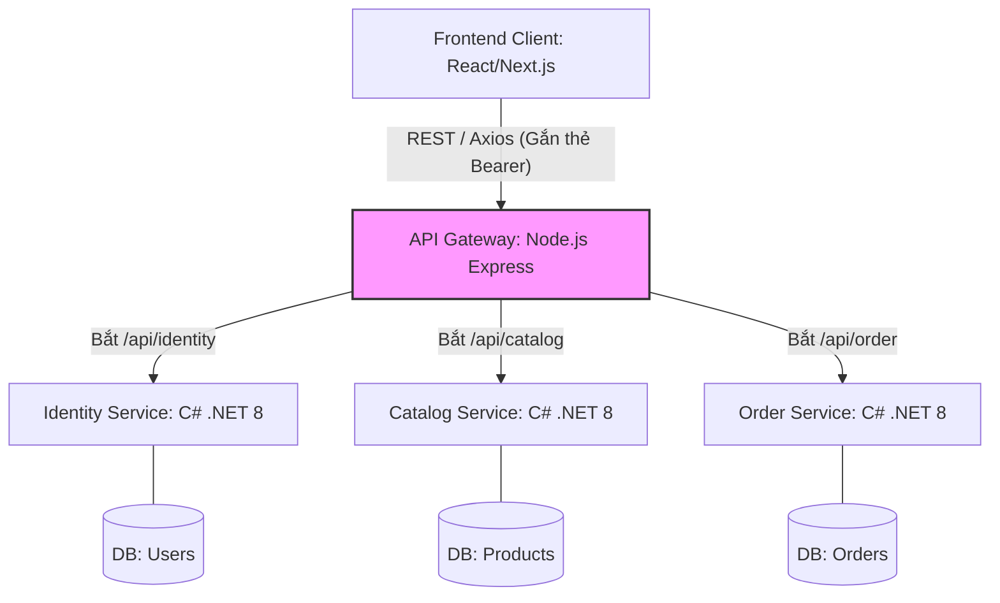

# 🌟 SMART POS & INVENTORY MANAGEMENT SYSTEM (Microservices Architecture)

Đây là tài liệu Mô tả Tổng quan Project (Project Overview) được thiết kế theo chuẩn Github README. Bạn có thể sử dụng nguyên văn bản mô tả này đưa vào CV Phỏng Vấn hoặc Kho lưu trữ mã nguồn của mình để giới thiệu với Nhà Tuyển Dụng.

---

## 🎯 1. Giới thiệu Dự án (Introduction)

**Smart POS** là hệ thống phần mềm nghiệp vụ quản lý bán lẻ đa điểm, quản lý kho hàng và xử lý giao dịch đơn hàng. 

Điểm nổi bật của dự án này không nằm ở UI/Giao diện người dùng cơ bản, mà tập trung sức mạnh vào **Kiến trúc hệ thống Backend**. Hệ thống được thiết kế hoàn toàn theo mô hình **Polyglot Microservices** nhằm giải quyết bài toán chịu tải cao, module hóa nghiệp vụ và quản lý rủi ro trên một quy mô lớn. 

Dự án áp dụng mô hình phân tách trạm gác bảo mật (API Gateway phi tập trung) và lõi xử lý giao dịch độc lập, là minh chứng rõ nét cho tư duy System Design chuyên sâu.

## 🚀 2. Stack Công Nghệ (Tech Stack)

Hệ thống pha trộn điểm mạnh của nhiều ngôn ngữ khác nhau:

- **UI & Frontend Engine:** React.js / Next.js (SPA, Axios cho API Call).
- **API Gateway & Routing:** Node.js, Express, `http-proxy-middleware`.
- **Bảo mật (Security):** `Passport.js` (JWT Authentication), bcrypt, Rate-limiting.
- **Microservices Engine (Core Logic):** C# ASP.NET Core 8 Web API.
- **Cơ Sở Dữ Liệu (Databases):** 
  - PostgreSQL / SQL Server (Cho các Service yêu cầu tính Transaction ACID: Sản phẩm, Đơn hàng).
  - Entity Framework Core.
- **DevOps & Containerization:** Docker, Docker Compose.

## 🏗️ 3. Sơ đồ Kiến trúc (Architecture Diagram)

Sơ đồ luồng (Data Flow) của hệ thống:



> [!NOTE]
> Client không bao giờ biết được CSDL hoặc Backend nội bộ đứng ở cụm IP nào. Mọi hoạt động phải đi mượn đường qua cổng Node.js duy nhất.

## 📦 4. Chi tiết Mô-đun (Microservices Breakdown)

Hệ thống được chia nhỏ thành 4 cụm Service chạy độc lập hoàn toàn, không xâm lấn Database của nhau:

### A. Tầng Cửa Ngõ (Node.js API Gateway)
- Lắng nghe trên cổng `8080`.
- Chặn mọi request đi vào `/api/*`. Giải mã token dán ở Header. Mất token -> Phản hồi HTTP 401 Unauthorized ngay lập tức.
- Thực hiện Proxy Mapping, uốn nắn URL và đẩy request "hợp pháp" xuống tầng C# ngầm.

### B. Dịch vụ Danh tính (.NET Identity Service)
- Lắng nghe tạo tài khoản, mã hóa dữ liệu nhân viên (Bcrypt/Hash Password).
- Kiểm tra Login và cấp phát (Sign) vé thông hành định dạng **JWT Token**. 

### C. Dịch vụ Lưu trữ kho (.NET Catalog Service)
- Chịu trách nhiệm nhập mã hàng, quản lý tên sảm phẩm, cấu hình giá, số lượng tồn kho theo chi nhánh.
- Logic tính điểm chuẩn số lượng để cảnh báo sắp cạn kho.

### D. Dịch vụ Đặt hàng (.NET Order Service)
- Service nặng đô nhất liên quan đến **ACID**. 
- Thực hiện thao tác khóa sản phẩm không cho phép mua trùng lặp trong khoảnh khắc giao dịch. Tính toán tiền, xuất hóa đơn thành trạng thái "Chờ xử lý".

## 🛠️ 5. Cách Khởi chạy Hệ thống (Local Setup)

Toàn bộ hệ thống được bó thành Docker. Bất kể nhà tuyển dụng dùng Mac OS hay Windows, đều chạy theo 2 lệnh:

```bash
# 1. Kéo mã nguồn về
git clone https://github.com/YourName/SmartPOS-Microservices.git

# 2. Xây dựng và khởi chạy một lúc tất cả Front, Gate, DB và Server
docker-compose up --build
```
